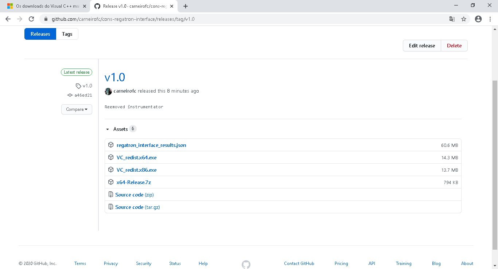

Installation Guide
==================

Usage
-----------

Download the latest release for your architecture.


Extract the compressed file, we are interested at the contents of `bin` folder.


Create a desktop shortcut in order to simplify the usage. The command line can also be used.


Alter the "Destination"/"Destino" including the serial COM port number. In the example we are using COM5 so the number '5' was appended to the end of the string.


Run the program


Centos OS 7
-----------

### Python
```
$ yum install -y epel-release
$ yum update
$ yum install python36 python36-pip
```

### Neovim
```
$ yum install -y https://dl.fedoraproject.org/pub/epel/epel-release-latest-7.noarch.rpm
$ yum install -y neovim python36-neovim
```

### GCC 9
```
$ yum makecache

#Install CentOS SCLo RH repository:
$ yum install centos-release-scl-rh

Install devtoolset-9 rpm package:
$ yum install devtoolset-9
$ source rh/devtoolset-9/activate
```

### CMake 3.17
```
$ https://github.com/Kitware/CMake/releases/download/v3.17.2/cmake-3.17.2.tar.gz
$ tar zxvf cmake-3.*
$ rm cmake-3.*.tar.gz
$ cd cmake-3.*
$ ./configure
$ make -j$(nproc)
$ make install
```
