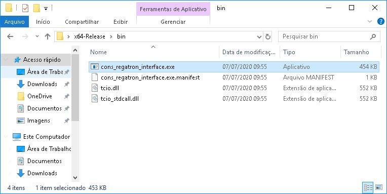
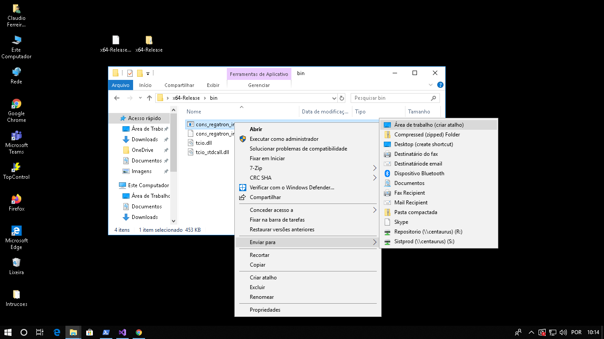
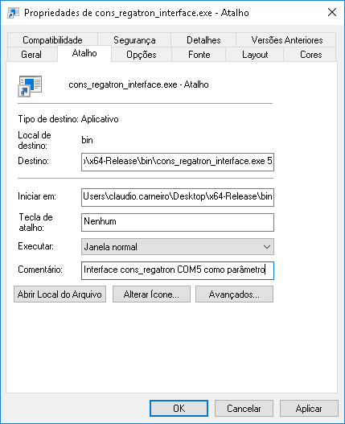

# Regatron interface
Regatron interface using sockets and Regatron's TCIO API
Use the service `cons-regatron-interface@.service` to start the interface.

## Usage

## [Notes](NOTES.md)
General development notes and status.

## [Dependencies](DEPENDENCIES.md)
Software dependencies

## [Installation](INSTALLATION.md)
OS environment setup.

## [Utils](UTILS.md)
General practices and useful tips.

